# 🏗️ Technical Architecture: Mini RAG Pipeline

This document provides a deep dive into the internal mechanics of the system. Unlike the root README, this focuses on how data flows through the modular services.

## 🗺️ System Flow Diagram

The following diagram illustrates the Fully Asynchronous lifecycle of a document, from initial upload to question answering.

## ⚙️ Core Component Breakdown

### 1. The Database Split

To optimize performance, we utilize two specialized data layers:

- **PostgreSQL (via asyncpg):** Manages "State." This includes document metadata (filenames, page counts, character counts) and timestamps for cleanup.
- **Qdrant:** Manages "Memory." This stores the 384-dimensional vectors and text payloads.

### 2. Processing Strategy

- **Memory Efficiency:** Large file operations are handled via chunked reading to prevent RAM spikes.
- **Event Loop Protection:** CPU-intensive tasks like text extraction and embedding generation are offloaded to worker threads using `asyncio.to_thread` to ensure the server remains responsive to other users.
- **Cleanup Janitor:** An asynchronous background task runs hourly to delete documents that haven't seen activity within 48 hours.

### 3. Security & Integrity

- **Prompt Injection Armor:** We use `<untrusted_context>` tags and strict system instructions to prevent the LLM from following commands hidden inside user documents.
- **Groundedness Check:** The system verifies if the LLM's response actually used the provided chunk IDs before displaying it to the user.

## 🛠️ Tech Stack Recap

- **Framework:** FastAPI (Fully Asynchronous)
- **Vector DB:** Qdrant
- **Relational DB:** PostgreSQL
- **Extraction:** PyMuPDF
- **LLM:** Groq (Llama-3.1-8b-instant)
- **Embeddings:** BGE-Small (Sentence-Transformers)